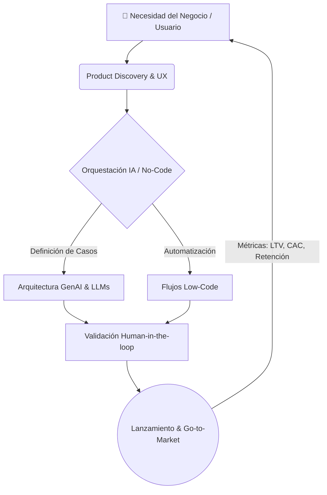

<h1 align="center">¡Hola! Soy Stephanie Castro 👋</h1>
<h3 align="center">Product Manager | Generative AI & Automation | Economista</h3>

  <!-- Contador de Visitas -->
  

  
  

---

## 🚀 Sobre Mí

Soy **Economista especializada en liderar productos digitales**, alineados a los objetivos de negocio. He dirigido estrategias de crecimiento y rentabilidad en sectores como retail, banca/fintech y ecommerce, gestionando **+4M de usuarios** y generando **+US$100M en ventas incrementales**, con gestión directa del P&L (+US$20M).

Con una trayectoria de **+50 proyectos ejecutados**, actualmente lidero la generación de productos digitales orientados a maximizar la eficiencia en ventas, comercial, growth y marketing. Mi enfoque parte del entendimiento profundo del negocio. Desde esa base, alineo a equipos y stakeholders alrededor de objetivos claros, combinando expansión comercial y liderazgo multidisciplinario *(Marketing, Growth, Producto, Data, Tecnología y UX)* con un uso estratégico de **IA Generativa y automatización** para priorizar las iniciativas que sostienen el crecimiento y la rentabilidad.

 

## 🧠 Mi Enfoque en Productos de IA (GenAI Flow)

Como PM Técnico, orquesto soluciones de Inteligencia Artificial asegurando que la tecnología resuelva problemas reales de negocio:

 

## 💼 Experiencia Actual

**Product Manager | Klipso**  
*Autónomo · Jul 2025 - Actualidad | Lima, Perú (Remoto)*

Diseño y opero infraestructuras digitales y omnicanal impulsadas por **IA generativa y automatización**, con impacto directo en generación de ingresos y reducción de costos operativos.

- **Liderazgo End-to-End:** Lidero el ciclo completo de producto: desde discovery y definición de casos de uso hasta el prototipado, validación y puesta en producción.
- **Arquitectura de IA:** Co-lidero con Tech Leads las decisiones de arquitectura de sistemas de IA, evaluando trade-offs técnicos y criterios de escalabilidad.
- **Gobernanza:** Aseguro una gobernanza responsable de los modelos en producción: control de alucinaciones, validación humana (Human-in-the-loop) y monitoreo continuo de calidad.
- **Go-to-Market & Métricas:** Gestiono el Customer Journey end-to-end y la estrategia de adquisición, asegurando que la solución escale desde el piloto al mercado.

 

## ⭐ Proyectos Clave (+25 proyectos B2B/B2C)

* 🤖 **Agentes Conversacionales (IA):** Lideré el diseño de agentes vía WhatsApp para Fintech, E-commerce y Servicios. **Impacto:** *Generación de hasta +30pp en conversión, escalando disponibilidad a 24/7.*
* ⚙️ **Orquestación No-Code/Low-Code:** Automaticé flujos cross-funcionales. **Impacto:** *Reducción de hasta -80% en tareas manuales y administrativas.*
* 📊 **Dashboards Estratégicos:** Implementación de tableros accionables. **Impacto:** *De 0 a producción en <6 semanas, gestionando +3 verticales de negocio.*
* 🎯 **Diagnósticos & Posicionamiento (GenAI):** Estrategias web con IA Generativa. **Impacto:** *Crecimiento de +50% en leads calificados con trazabilidad CRM.*

 

## 🛠️ Mi Toolkit & Tech Stack

**Gestión de Producto, UI/UX y Flujos:**

  

**Análisis de Datos, Automatización & Ops:**

  
  
  
  
  

---

## 🎯 Búsqueda Actual y Colaboraciones

Actualmente estoy enfocada en:
1. 🏢 **Oportunidades como Lead PM** en Startups o empresas Corporativas, con base en Perú, Europa o LATAM.
2. 🌍 **Colaborar en proyectos Open Source de IA Generativa**, aportando desde la definición y estructuración de la estrategia de producto.
3. 🚀 **Participar en Hackathons** liderando el enfoque de Product Management: *Product Discovery, validación de necesidad y diseño de estrategias Go-to-Market.*

  <i>"No te enamores de la solución, enamórate del problema."</i>

